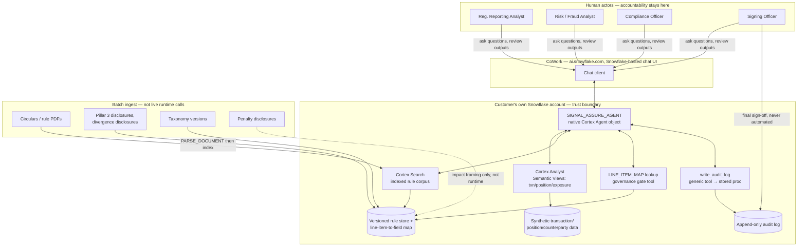
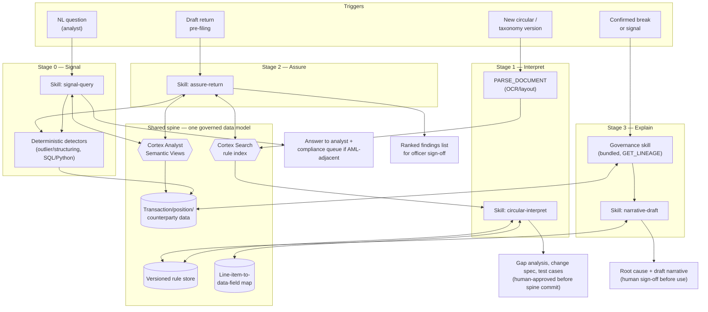
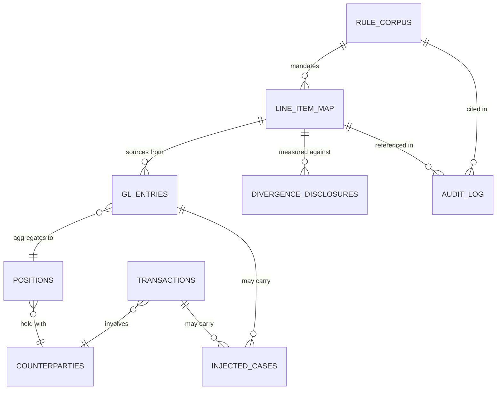
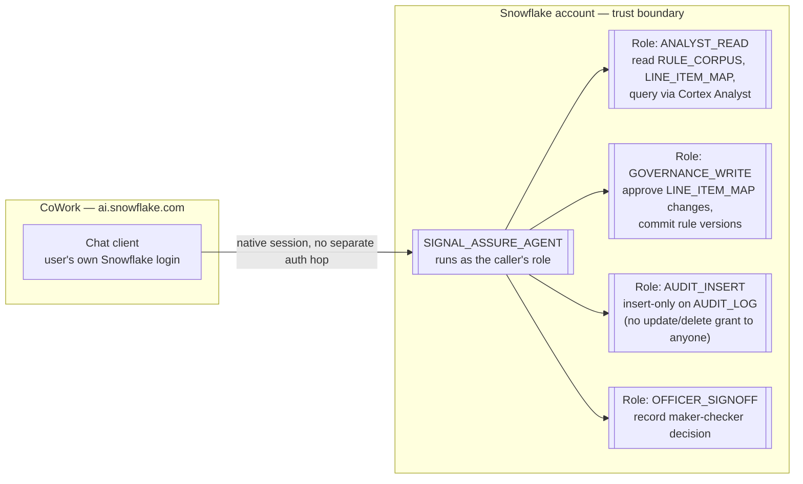
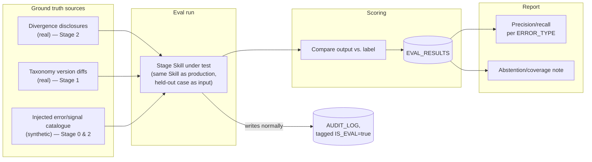

# Architecture — Regulatory Reporting Lifecycle Agent

Companion to `regulatory-reporting-problem-statement.md`. Built incrementally, one section at a time. Grounded against verified Snowflake/Coco platform capabilities as of Sept 2026, not just the problem statement's claims.

**Team:** solo build (user + Claude) — see corrections this implies for scope/sequencing in the problem statement review.

---

## Platform capability notes (verified Sept 2026)

Corrections to the problem statement's platform assumptions, found by checking current Snowflake docs:

- **Cortex Search does not ingest PDFs directly.** Pipeline is parse → chunk → index: `PARSE_DOCUMENT`/`AI_PARSE_DOCUMENT` (OCR/layout mode) extracts text first, then Cortex Search chunks and indexes it. Stage 1 needs this as an explicit step, not zero-config ingestion. Carry page/section metadata through the chunking step manually to get paragraph-level citation.
- **A Snowflake "Skill" is a markdown file** (`SKILL.md`: YAML frontmatter + workflow steps + common-mistakes notes), not a governed/RBAC-locked executable unit. Lighter to author solo than the plan implies, but weaker as a defensible "moat" — it's a prompt procedure, not proprietary logic locked behind a Snowflake object.
- **Lineage tracing is real and stronger than the plan assumes.** `GET_LINEAGE`/`ACCESS_HISTORY` require Enterprise Edition or higher — confirmed by testing `cortex lineage` live (a fresh Standard-edition account returned `Unsupported feature 'Data Lineage'`; after upgrading to Enterprise via `ALTER ACCOUNT SET EDITION`, the same command returned a real lineage result). Account is on Enterprise. Stage 3 can reuse native lineage rather than building custom lineage logic.
- **Coco Agent SDK is server-side only** (Python/TS, holds the Snowflake connection via keypair/service-account auth). The review UI must be a thin web frontend talking to a backend service — the SDK is not embeddable directly in a browser. It does give structured/schema-validated JSON output, which fits Stage 2's "ranked findings + citation" shape well.
- **Cortex Analyst accuracy degrades with schema complexity** — build one Semantic View per bounded domain (transactions, positions, exposures) rather than one giant model. New **Semantic Views** (native, RBAC-integrated) are the recommended path over the legacy YAML-on-stage approach, though the latter is faster to iterate solo. 9 regions currently supported (AWS/Azure) — confirm target jurisdiction's data-residency requirement against this list once jurisdiction is picked.
- **"Data never leaves the account" needs a precise caveat.** Cross-region inference routing exists (same-cloud: Snowflake's private backbone; cross-cloud: public internet with mTLS) — still inside Snowflake's security perimeter, never a third-party SaaS, but not literally single-region-contained. State this precisely in the pitch rather than as an absolute.
- No evidence Snowpark Container Services is required — Cortex Analyst, Cortex Search, Coco Skills, and the Agent SDK cover the full stack. Only the external web frontend needs hosting outside Snowflake.
- **A native "Cortex Agent" object replaced the custom backend + review UI entirely — confirmed live, not just spiked.** `PRAMAN.CORE.SIGNAL_ASSURE_AGENT` (spec: `cortex_project/SIGNAL_ASSURE_AGENT.agent.yaml`) is a declarative Snowflake object (`CREATE AGENT`) with six tools — three `cortex_analyst_text_to_sql` tools over the Semantic Views, `line_item_map_lookup` (the Stage 2 governance gate), `rule_corpus_search`, and `write_audit_log` (a `generic` tool wrapping a stored procedure) — connected to **CoWork** (`ai.snowflake.com`) with zero custom hosting. The "one agent vs. one per stage" question this note originally left open (and the Days 9–12 build plan below once posed as pending) is **decided and built**: one combined agent for Stage 0 + Stage 2, since both share the same Semantic Views, detector views, and `ANALYST_READ` role (full pros/cons: `.claude/plans/lets-decide-what-would-rippling-lighthouse.md`). The original `TRANSACTIONS_AGENT` spike object was retired after `SIGNAL_ASSURE_AGENT` passed verification. Real platform limitations found deploying it, not assumed: a `generic` tool's `input_schema` doesn't support `array`-typed properties (worked around with a comma-delimited `VARCHAR` + `SPLIT()`), and the agent silently drops arguments it treats as optional, which breaks positional stored-procedure calls unless every parameter is marked `required`. This is the same kind of platform-assumption correction as the lineage/Cortex Search entries above — verified against live behavior, not the plan's original assumption of a custom Python/TS backend.

---

## System context

Actors, external systems, and the trust boundary.

Everything — reasoning, data, and the chat UI itself — lives inside the customer's own Snowflake account or Snowflake-hosted surface (CoWork). There is no externally-hosted component and no separate credential-holding backend: `SIGNAL_ASSURE_AGENT` is a declarative `CREATE AGENT` object, and CoWork connects to it natively. This superseded the originally-planned thin-web-frontend-plus-backend-service design once the Cortex Agent + CoWork spike confirmed it wasn't needed — see the Platform capability notes above.

---

## Per-stage component architecture

How each stage's trigger reaches the shared spine, which Skill (`SKILL.md`) orchestrates it, and where the deterministic/LLM boundary from the problem statement's table lands in the actual call path. The "one detector, two consumers" reuse (outlier/structuring scoring feeding both Stage 0 and Stage 2) is deliberate — it's the same SQL/Python routine, not a Stage-2-specific copy.

| Stage | Trigger | Snowflake services | Skill | Deterministic component | Output | Citation type |
|---|---|---|---|---|---|---|
| **0 — Signal** | NL question | Cortex Analyst (Semantic Views: transactions / positions / exposures) | `signal-query` | Outlier/structuring detectors (SQL/Python) | Structured insight + narrative; AML-adjacent flags route to compliance queue, never auto-filed | Query + data lineage |
| **1 — Interpret** | New circular/taxonomy PDF | `PARSE_DOCUMENT` → Cortex Search (rule index) | `circular-interpret` | — | Gap analysis, change spec, test cases — human-approved before committing to the spine | Rule paragraph + version |
| **2 — Assure** | Draft return | Cortex Search (rule text) + Cortex Analyst (filing history / peer benchmarks) | `assure-return` | Same outlier detector as Stage 0 | Ranked findings list, one entry per finding | Rule citation *or* data lineage, per finding |
| **3 — Explain** | Confirmed break or signal | Bundled governance skill (`GET_LINEAGE`) + Cortex Search (remediation basis) | `narrative-draft` (thin layer on the governance skill) | — | Ranked root causes, remediation, draft regulator/compliance narrative | Lineage trace + rule citation |

**Spine directionality** (from the problem statement, confirmed by this design): Stage 0 queries the transaction/position data live; Stage 1 walks the rule store forward onto the line-item map; Stage 2 walks the same map backward from a draft return to rule text; Stage 3 walks lineage down from a report line item to source rows. Four directions, one governed model — this is what keeps it one product instead of four demos.

**Build implication for a solo timeline:** `signal-query` and `assure-return` are the two Skills carrying the most net-new logic (they orchestrate multiple services). `narrative-draft` is thin — most of Stage 3's real work is the bundled governance skill, which needs prompting, not building. `circular-interpret` is the one Skill with an extra pipeline stage (`PARSE_DOCUMENT`) the problem statement didn't budget for.

---

## Shared data model

The governed tables every stage reads or writes. `RULE_CORPUS` is the base table Cortex Search indexes (chunking/embedding is managed — these are the attribute columns you filter and cite on). Everything else is plain Snowflake tables; lineage between them is native (`GET_LINEAGE`), so this section only needs to fix the *business* relationships, not re-derive object lineage.

| Table | Key columns | Written by | Read by |
|---|---|---|---|
| `RULE_CORPUS` | `CHUNK_ID` (PK), `DOC_ID`, `JURISDICTION`, `VERSION`, `EFFECTIVE_DATE`, `SECTION_REF`, `PAGE_NO`, `CHUNK_TEXT`, `SUPERSEDES_CHUNK_ID`, `INGESTED_AT` | Stage 1 ingest pipeline (`PARSE_DOCUMENT` → chunk) | Stage 1 (`circular-interpret`), Stage 2 (`assure-return`), Stage 3 (`narrative-draft`) |
| `LINE_ITEM_MAP` | `LINE_ITEM_ID` (PK, e.g. DPM/MDRM code), `REPORT_NAME`, `TAXONOMY_VERSION`, `SOURCE_TABLE`, `SOURCE_COLUMN`, `TRANSFORM_LOGIC`, `RULE_CHUNK_ID` (FK), `STATUS` (proposed/approved), `APPROVED_BY`, `VALID_FROM`/`VALID_TO` | Stage 1 proposes; human governance approval commits | All four stages |
| `GL_ENTRIES` | `ENTRY_ID` (PK), `ACCOUNT_CODE`, `AMOUNT`, `POSTING_DATE`, `COUNTERPARTY_ID` (FK), `POSITION_ID` (FK), `INJECTED_CASE_ID` (FK, nullable) | Synthetic data generator (bottom-up from real filed return) | Stage 2, Stage 3 lineage trace |
| `POSITIONS` | `POSITION_ID` (PK), `INSTRUMENT_TYPE`, `NOTIONAL`, `EXPOSURE_CLASS`, `COUNTERPARTY_ID` (FK), `AS_OF_DATE` | Synthetic data generator | Stage 0 (Semantic View), Stage 3 |
| `COUNTERPARTIES` | `COUNTERPARTY_ID` (PK), `SECTOR`, `JURISDICTION`, `RISK_RATING`, `CONCENTRATION_GROUP` | Synthetic data generator | Stage 0, Stage 3 |
| `TRANSACTIONS` | `TXN_ID` (PK), `COUNTERPARTY_ID` (FK), `AMOUNT`, `TIMESTAMP`, `CHANNEL`, `INJECTED_CASE_ID` (FK, nullable) | Synthetic data generator | Stage 0 (Semantic View + detectors) |
| `INJECTED_CASES` | `CASE_ID` (PK), `TYPE` (classification / timing / sign / unit-scale / double-counting / stale-ref / defensible-interpretation / correct-but-anomalous / structuring), `GROUND_TRUTH_LABEL`, `EXPECTED_STAGE` | Synthetic data generator, at build time | Eval harness only — never surfaced to the agent at runtime |
| `DIVERGENCE_DISCLOSURES` | `DISCLOSURE_ID` (PK), `BANK_NAME`, `FISCAL_YEAR`, `LINE_ITEM_ID` (FK → `LINE_ITEM_MAP`), `REPORTED_VALUE`, `RBI_ASSESSED_VALUE`, `DIVERGENCE_AMOUNT`, `DIVERGENCE_PCT`, `DISCLOSURE_DATE`, `SOURCE_DOCUMENT` | Real data ingest (public divergence disclosures — India substitutes this for literal amended-vs-original filing pairs, per the jurisdiction decision) | Stage 2 eval (ground truth #1) |
| `AUDIT_LOG` | `RUN_ID` (PK), `TIMESTAMP`, `USER`, `STAGE`, `PROMPT_OR_QUESTION`, `MODEL_VERSION`, `RETRIEVED_RULE_CHUNK_IDS` (array) or `QUERY_SNAPSHOT_ID`, `OUTPUT`, `HUMAN_DECISION`, `SIGNOFF_BY`, `SIGNOFF_AT` | Every Skill invocation, append-only | Compliance, internal audit, evidence pack export |

`INJECTED_CASES` is the one table that must never leak into a Skill's retrieval or prompt context — it exists purely for scoring precision/recall after the fact. Keep it in a separate schema with no grant to the roles the Skills run as, so a bug can't accidentally let the agent "see the answer key."

---

## Deployment & security

- **Compute placement.** Cortex Analyst, Cortex Search, and the Cortex Agent itself all run on Snowflake-managed compute, billed per-message/warehouse — no Snowpark Container Services needed. The deterministic detectors (`ZSCORE` UDF, `TRANSACTION_SIGNALS`/`GL_OUTLIER_SIGNALS`/`CREDIT_EXPOSURE_SV`'s outlier metrics) run as Snowflake SQL, so they're inside the perimeter too. **There is no component outside Snowflake at all** — no backend service, no separate credential to vault or rotate. This is stronger than the original design's "backend holds one hardened credential" posture, not just simpler.
- **RBAC boundary.** Four roles is enough to separate the concerns that matter for audit-readiness: read access to the rule store and map (broad — every analyst), write/approve access to `LINE_ITEM_MAP` (governance only), insert-only on `AUDIT_LOG` (no role, including admin, gets update/delete — that's what makes "append-only" an enforced grant, not a policy statement), and sign-off recording (officer only). This maps directly onto the maker-checker requirement in the Audit section of the problem statement.
- **No standing service credential.** `SIGNAL_ASSURE_AGENT` executes under the calling user's own session/role via CoWork, not a shared service account — a compromised CoWork session is bounded by that user's own grants, the same as if they'd run SQL directly.
- **Region/residency.** Confirm the chosen jurisdiction's data-residency requirement against Snowflake's current Cortex Analyst region list (9 regions, AWS/Azure, as of this research) before committing to that jurisdiction — this was an open item in the problem statement and is now a concrete pre-flight check, not just a note.
- **Cross-region inference caveat carries through here too:** if cross-region inference is enabled on the account, LLM calls can route over Snowflake's private backbone (same-cloud) or the public internet with mTLS (cross-cloud) — still inside Snowflake's perimeter, never third-party, but worth disabling or scoping explicitly if the pitch states a hard single-region guarantee.
- **Production note.** Because there's no external component at all in this design, "runs inside the customer's own Snowflake account" already holds for the hackathon build, not just the roadmap — nothing about a real deployment changes this boundary.

---

## Evaluation architecture

The problem statement's Evaluation section names three ground-truth sources and a "precision/recall per error type, not aggregate" requirement. That needs its own component — it was missing from every diagram above, so here it is as one.

- **Same path, held-out input, not a separate code path.** An eval run calls the exact same Skill (`assure-return`, `circular-interpret`, `signal-query`) that production traffic uses — the only difference is the input is a held-out ground-truth case instead of a live question, and the `AUDIT_LOG` row gets `IS_EVAL = TRUE` so eval traffic never contaminates the audit trail judges/officers would review. This is also what makes the eval numbers credible: they're not measuring a special-cased eval mode, they're measuring the thing that ships.
- **`EVAL_RESULTS` table:** `EVAL_ID` (PK), `RUN_ID` (FK → `AUDIT_LOG`), `STAGE`, `CASE_ID` (FK → `INJECTED_CASES`) or `DISCLOSURE_ID` (FK → `DIVERGENCE_DISCLOSURES`) or `TAXONOMY_DELTA_ID`, `ERROR_TYPE`, `GROUND_TRUTH_LABEL`, `AGENT_OUTPUT`, `MATCH_STATUS` (`true_positive` / `false_positive` / `false_negative` / `abstained`), `MODEL_VERSION`, `RULE_VERSION`.
- **`abstained` is a first-class match status, not a missing row.** The problem statement's abstention/coverage argument ("an agent that escalates 20% and is right on the rest is deployable") only has teeth if abstention is tracked as its own outcome in the scoring table — otherwise it silently collapses into false negatives and the coverage argument has no numbers behind it in the demo.
- **Report precision/recall grouped by `ERROR_TYPE`**, one row per type (classification, timing/cut-off, sign, unit/scale, double counting, stale reference, defensible-interpretation, correct-but-anomalous, structuring/AML) — never a single blended number. A `GROUP BY ERROR_TYPE` over `EVAL_RESULTS` is the whole "report" for the demo; no separate BI layer needed at prototype scale.
- **Recall-tuning tradeoff (from the problem statement) is now checkable, not just stated:** since false positives and false negatives are both rows in `EVAL_RESULTS`, whatever detection threshold Stage 0/2 ship with can be validated against the injected catalogue before demo day, rather than asserted.

---

## Build plan

Solo build, ~18 days (13–30 Sept). Day numbers are relative to Day 1 = Sept 13, sequential — no team to parallelize across, so phases are ordered by hard dependency, not by convenience.

**Skills audit** (checked against `Snowflake-Labs/coco-skills`, the public bundled-skills repo, before writing anything new):

| Our Skill | Bundled equivalent? | Action |
|---|---|---|
| Cortex Analyst Semantic Views (Stage 0/2) | **Yes** — `semantic-view-patterns` (25 production-tested join/metric/dimension patterns) | Fork as starting template, don't author from scratch |
| `signal-query` (Stage 0) | No | Author new |
| `circular-interpret` (Stage 1, incl. `PARSE_DOCUMENT` step) | No — repo has no PDF/RAG-ingestion skill | Author new |
| `assure-return` (Stage 2) | No | Author new |
| Lineage tracing (Stage 3) | **Yes — confirmed by live test, Day 1.** `cortex lineage` initially failed on a Standard-edition account (`Unsupported feature 'Data Lineage'`); after upgrading to Enterprise via `ALTER ACCOUNT SET EDITION`, it returned a real result against `SNOWFLAKE_SAMPLE_DATA.TPCH_SF1.ORDERS`. | Prompt the bundled governance skill directly, per the original plan — no custom lineage build needed |

### Day 1 — Decide & de-risk (hard blockers, nothing else starts until these close)
1. ~~Pick the jurisdiction, based on real, machine-readable rule/eval data availability.~~ **Done — India (RBI).** Circulars/Master Directions and penalty disclosures are cleanly public. Two substitutions vs. the original plan, both verified as real and workable: RBI's current taxonomy/validation-rule store (CIMS) is login-gated (unlike EBA DPM/FFIEC MDRM), so the synthetic firm anchors on public **Basel III Pillar 3 disclosures** (every listed bank publishes these quarterly) instead of a raw CIMS return; and in place of literal amended-vs-original filing pairs, Stage 2's eval uses RBI's **divergence-disclosure** mechanism (a bank must publicly disclose within 24 hours when RBI's inspection finds its reported NPA/provisioning diverges from the regulator's own assessment by more than a threshold — e.g. YES Bank's ₹3,277cr divergence disclosure, FY19) — a genuinely clean "reported vs. regulator-corrected" pair, public per case.
2. ~~Provision/confirm Snowflake account + Coco CLI access; confirm the account's region covers that jurisdiction's data-residency requirement.~~ **Done.** Account `SBOBPMM-YB05177`, region `AWS_AP_SOUTHEAST_7` (Malaysia), Enterprise edition (upgraded from the trial's Standard default via `ALTER ACCOUNT SET EDITION` — no card or separate account needed, since this account already had `ORGADMIN` available), keypair auth configured and tested live via `cortex exec`.
3. ~~Spike: in the actual Coco CLI, ask it to trace lineage on a toy table.~~ **Done — confirmed working.** `cortex lineage SNOWFLAKE_SAMPLE_DATA.TPCH_SF1.ORDERS` returns a real result on Enterprise edition. Stage 3 proceeds as originally planned — prompt the bundled governance skill, no custom lineage build.

### Days 2–3 — Real data sourcing
4. ~~Pull, for India: circular, Pillar 3 disclosure, divergence disclosure, penalty disclosures.~~ **Done.** Saved to `data/raw/`: two RBI Master Directions from the July 2026 consolidation (`...412...Fraud_Risk_Management...` — Stage 0 candidate; `...415...Supervisory_Returns...` — Stage 1 candidate, closer to "report instructions"), `HDFC_Bank_Basel_III_Pillar3_2026-06-30.pdf` (confirmed derivatives exposure), the YES Bank FY18/FY19 divergence disclosures (secondary reporting only — the primary BSE exchange filing needs a manual lookup, noted as a gap), and two penalty sources (a third-party FY24-25 compilation plus one confirmed-working official RBI press release URL pattern for pulling more later). `rbidocs.rbi.org.in` PDFs are CAPTCHA-gated — the `.aspx` page text is the reliable path for further RBI pulls.
5. Pick the one Pillar 3 disclosure that anchors the synthetic firm. **Done — HDFC Bank, quarter ending 2026-06-30.**

### Days 3–6 — Synthetic data + Snowflake foundation
6. Build the synthetic data generator (GL entries, positions, counterparties, transactions that aggregate to the anchor filing's real line items).
7. Load into Snowflake; create `RULE_CORPUS`, `LINE_ITEM_MAP`, `AUDIT_LOG`, `INJECTED_CASES` per the data model above.
8. Set up RBAC roles and grants (`ANALYST_READ`, `GOVERNANCE_WRITE`, `AUDIT_INSERT` insert-only, `OFFICER_SIGNOFF`).
9. Ingest the circular: `PARSE_DOCUMENT` → chunk with page/section metadata → `CREATE CORTEX SEARCH SERVICE`.
10. Seed `LINE_ITEM_MAP` with approved mappings for the report line items in scope.

### Days 6–9 — Semantic layer, detectors, Skills
11. Build Cortex Analyst Semantic Views (transactions / positions / exposures), forking `semantic-view-patterns`.
12. Build deterministic detectors (SQL/Python: outlier scoring, structuring/velocity rules) — one implementation, shared by Stage 0 and Stage 2.
13. Author `signal-query`, `circular-interpret`, `assure-return` as `SKILL.md` files.
14. Author or extend the lineage/`narrative-draft` skill for Stage 3, per the Day 1 spike result.

### Days 9–12 — Backend + review UI ✅ Done
15. ~~**Spike first:** create one real Cortex Agent over `TRANSACTIONS_SV`, connect it to CoWork, ask it a live question end-to-end.~~ **Done — holds up.** `PRAMAN.CORE.TRANSACTIONS_AGENT` live, CoWork-connected, correct answers with citations back to the semantic view. See the platform-capability note above for the one quirk found (metric-name fallback in generated SQL).
16. ~~Extend to cover `POSITIONS_SV`/`CREDIT_EXPOSURE_SV` and `RULE_CORPUS_SEARCH`; distill each `SKILL.md` into the agent's `instructions.orchestration`/`instructions.response`.~~ **Done.** `TRANSACTIONS_AGENT` retired; `PRAMAN.CORE.SIGNAL_ASSURE_AGENT` built in its place with six tools (three `cortex_analyst_text_to_sql` over the three Semantic Views, `line_item_map_lookup`, `rule_corpus_search`, `write_audit_log`), covering Stage 0 + Stage 2.
17. ~~Scope the remaining custom backend down to what CoWork can't do declaratively.~~ **Done — the answer turned out to be "nothing."** `write_audit_log` is a `generic` Cortex Agent tool wrapping `SP_WRITE_AUDIT_LOG`, so `AUDIT_LOG` writes happen per-invocation with no custom service in front of CoWork at all. No `backend/`/`ui/` code was needed for Stage 0/2.
18. ~~Open design question: one Cortex Agent with several tools, or one agent per stage?~~ **Decided and built: one agent for Stage 0 + Stage 2** (they share Semantic Views, detector views, and `ANALYST_READ`). Full pros/cons in `.claude/plans/lets-decide-what-would-rippling-lighthouse.md`.

### Days 12–15 — Wire the four stages end-to-end ✅ Done
18. ~~Stage 0 live: NL question → answer.~~ **Done** — covered by `SIGNAL_ASSURE_AGENT`.
19. ~~Stage 2 live: draft return → ranked findings with citations.~~ **Done**, after fixing a real gap: the agent had no tool to query `LINE_ITEM_MAP` at all, so its "no approved mapping" answers were a hardcoded default, not a real `STATUS` check. Added `LINE_ITEM_MAP_SV` + `line_item_map_lookup` as a mandatory first step; re-tested clean.
20. ~~Stage 1 slice: the one real circular → gap analysis, change spec, test cases.~~ **Done** — `demos/stage1_circular_415_gap_analysis.md`.
21. ~~Stage 3 scripted walkthrough: one injected break → lineage trace → root cause + narrative.~~ **Done** — `demos/stage3_lineage_walkthrough.md`, real live `cortex lineage` trace applied to an explicitly-labeled illustrative scenario (no real injected lineage break exists yet).

### Days 15–17 — Eval ✅ Done (12/12)
22. ~~Build the `INJECTED_CASES` catalogue and `EVAL_RESULTS` table.~~ **Done** — 9 injected cases + 3 divergence-disclosure ground-truth rows, isolated in `PRAMAN.EVAL`, no grant to the agent's runtime role.
23. ~~Run the eval slice, report per error type.~~ **Done, across three runs.** v1: 7/12 correct, every miss root-caused (governance-gate overreach on basic integrity checks, wrong dedup key, missing column, one instruction-wording gap). v2, after 4 fixes: 11/12. v3, after the 5th fix: **12/12**, zero regressions at any point. Full detail: `eval/results.md`.
24. ~~Build the evidence-pack export from `AUDIT_LOG`.~~ **Done** — `AUDIT_EVIDENCE_PACK`, granted to `GOVERNANCE_WRITE`, 7 rows returned on verify.
25. ~~Fix #5 (per-counterparty scale baseline for the `correct_but_anomalous` false positive).~~ **Done.** `CREDIT_EXPOSURE_SV` gained a per-counterparty baseline (`counterparty_account_baseline_mean`/`_stddev`/`_count`) reusing the shared `ZSCORE` formula, plus a `CONCENTRATION_GROUP` cross-reference in orchestration. Landed differently than first planned: Snowflake rejects a Semantic View metric referencing another window-function metric, so the agent computes the z-score at query time from the three baseline metrics rather than reading a pre-named one — functionally identical, see `eval/results.md`'s implementation note.

### Days 17–18 — Rehearse & submit ⬜ Not started
26. Dry-run the live path judges will actually see (Stage 0 + Stage 2) repeatedly — that's what's live, protect it over polish elsewhere.
27. Finalize pitch deck (penalty-disclosure impact framing) and submit.

**Single biggest risk to this schedule:** if Day 1's jurisdiction pick turns up gaps in any of the five real-data requirements (step 1), everything downstream slips — don't start Day 2 sourcing until all five are confirmed to exist for the chosen jurisdiction, even if that means spending part of Day 1 checking two candidate jurisdictions before committing.
