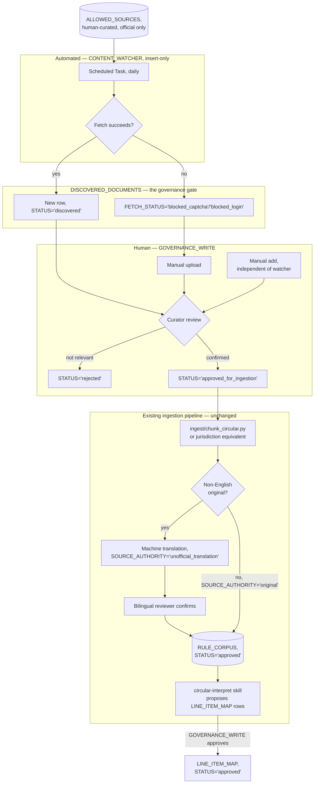
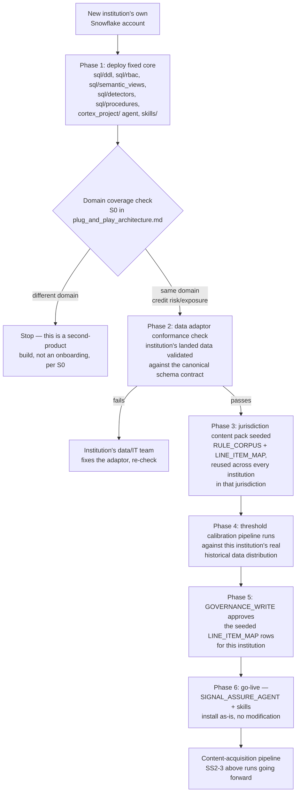

# Plug-and-play, from scratch — actors, content acquisition, build sequence

Companion to `plug_and_play_architecture.md` (the four adaptor boundaries + §0 domain check) and `regulatory_landscape_research.md` (the cross-market evidence behind it). Those answer "what changes per institution/jurisdiction." This doc answers three narrower questions asked directly: **who does what**, **how does new regulatory content actually get in** (upload vs. scrape vs. scheduled watcher, with manual override), and **what's the literal build order from an empty Snowflake account**.

Nothing here is built. This is a design, the same status as its two companion docs.

## 1. Actors

Two groups: people, and the one new automated actor this design adds. Everything else (the agent, the skills) already exists.

### People

| Actor | Maps to existing role? | Responsibility |
|---|---|---|
| **Reg. Reporting Analyst** | `ANALYST_READ` (exists) | Asks Stage 0/2 questions, no content or governance authority |
| **Compliance/Governance Officer** | `GOVERNANCE_WRITE` (exists) | Approves `LINE_ITEM_MAP` rows — **and, per the RBAC actually already granted (`sql/rbac/02_governance_write.sql`: `GRANT SELECT, INSERT ON RULE_CORPUS TO GOVERNANCE_WRITE`), this is also the role that approves new circular content into `RULE_CORPUS`.** No new human role is needed for content curation — it was already scoped into the existing design, just never exercised end-to-end. Whether one person or two different people hold this role for the two responsibilities is an org decision (see §2's separation-of-duties note), not an architecture requirement. |
| **Signing/Compliance Officer** | `OFFICER_SIGNOFF` (exists) | Records the maker-checker sign-off on a Stage 2 finding |
| **Platform/Account Admin** | `ACCOUNTADMIN`/`SECURITYADMIN` (exists) | Runs the one-time per-institution deployment (Phase 1 below), configures the source allow-list, runs calibration |
| **Institution's Data/IT team** | Not a Praman role — external | Owns the data adaptor (`plug_and_play_architecture.md` §1); outside Praman's account entirely for a real deployment |
| **Bilingual reviewer** (new responsibility, not necessarily a new role) | Could be `GOVERNANCE_WRITE` with a language qualification, or a distinct narrow role if an institution wants separation of duties | Confirms a machine-translated rule chunk (§3 below) before it's citable — only needed for jurisdictions where the authoritative text isn't English |

### The one new automated actor

**`CONTENT_WATCHER`** — a service identity for a scheduled process, not a human. Deliberately the narrowest possible grant, matching the exact insert-only, no-read-back pattern `AUDIT_INSERT` already establishes (`sql/rbac/03_audit_insert.sql`): `INSERT`-only on a new `DISCOVERED_DOCUMENTS` table (§2), nothing else. It cannot write to `RULE_CORPUS` directly — same governed-gate discipline `LINE_ITEM_MAP`'s `proposed`→`approved` flow already uses, extended to content discovery instead of invented fresh.

## 2. How new content actually gets in — upload, scrape, or both

Answering directly: **both, deliberately, because this project's own sourcing work already proved a pure-scrape design breaks.** `data-sources.md` hit RBI's own CAPTCHA gate blocking a downloadable spec that was otherwise real and public — a scraper alone would have silently failed there, not degraded gracefully. The design below is a hybrid with an explicit escalation path for exactly that failure mode.

### The mechanism

A new table, `DISCOVERED_DOCUMENTS`, is the proposed-content equivalent of `LINE_ITEM_MAP`'s governance gate:

```sql
CREATE TABLE DISCOVERED_DOCUMENTS (
  DOC_ID           VARCHAR PRIMARY KEY,
  SOURCE_URL       VARCHAR NOT NULL,
  SOURCE_SITE      VARCHAR NOT NULL,   -- must match a row in ALLOWED_SOURCES
  JURISDICTION     VARCHAR,
  DOC_TITLE        VARCHAR,            -- auto-extracted, human-editable before approval
  DISCOVERED_AT    TIMESTAMP_NTZ,
  FETCH_STATUS     VARCHAR,            -- 'fetched' | 'blocked_captcha' | 'blocked_login' | 'manual_upload_needed'
  STATUS           VARCHAR DEFAULT 'discovered',  -- 'discovered' | 'rejected' | 'approved_for_ingestion' | 'ingested'
  REVIEWED_BY      VARCHAR,
  REVIEWED_AT      TIMESTAMP_NTZ,
  NOTES            VARCHAR
);

CREATE TABLE ALLOWED_SOURCES (
  SOURCE_SITE   VARCHAR PRIMARY KEY,   -- e.g. 'rbi.org.in/circulars-index'
  JURISDICTION  VARCHAR NOT NULL,
  SITE_TYPE     VARCHAR,               -- 'official_index' | 'official_rss' | 'official_press_release'
  ADDED_BY      VARCHAR,
  ADDED_AT      TIMESTAMP_NTZ
);
```

**`ALLOWED_SOURCES` is explicit, human-curated, and never open-web.** Only a regulator's own official publication page/feed goes in it — never a third-party compilation or aggregator, even a good one. This project already drew that exact line once: `regulatory_landscape_research.md`'s penalty research used FACE's third-party compilation deliberately (fine for impact-framing analysis), but every citable `RULE_CORPUS` source in this project has always been the regulator's own primary text. `ALLOWED_SOURCES` makes that discipline an enforced table, not a habit — inserting a row is a `GOVERNANCE_WRITE` action, same role, so a curator can't be scraped-around by an accidental bad URL.

### The daily flow

1. **A scheduled Snowflake Task** (daily is the right default cadence — regulator index pages change rarely, and this is a cheap existence-check, not a full fetch) runs as `CONTENT_WATCHER`, walks every row in `ALLOWED_SOURCES`, and diffs each site's current listing against what's already in `DISCOVERED_DOCUMENTS`. Outbound access is scoped via a Snowflake **`NETWORK RULE` + `EXTERNAL ACCESS INTEGRATION`** naming the exact allow-listed hostnames — not open internet access from inside the account, the same least-privilege posture the RBAC design already applies everywhere else.
2. **A genuinely new listing** gets inserted into `DISCOVERED_DOCUMENTS` with `STATUS = 'discovered'`. If the actual document fetch succeeds, `FETCH_STATUS = 'fetched'`. If it hits a login wall or a CAPTCHA (the real RBI case), `FETCH_STATUS = 'blocked_captcha'`/`'blocked_login'` — the row still gets created, flagged, and queued for a human, rather than silently disappearing.
3. **A human (`GOVERNANCE_WRITE`) reviews the queue.** For a `fetched` row: confirm it's genuinely new/relevant, correct the auto-extracted title/date if needed, approve. For a `blocked_*` row: **manually upload the file** the same way this project has always sourced documents (matching `data-sources.md`'s own established pattern) — the automation degrades to exactly the manual path that already works, it doesn't block on it.
4. **Approval (`STATUS = 'approved_for_ingestion'`) triggers the existing pipeline** — `ingest/chunk_circular.py` (or its jurisdiction-specific equivalent, `plug_and_play_architecture.md` §4) runs against the now-confirmed document, same as today.
5. **Manual add, any time, independent of the watcher** — a curator can insert a `DISCOVERED_DOCUMENTS` row directly for a document they found by any other means (a colleague forwarded it, a news alert, anything) and walk it through the same review→approve→ingest path. The watcher is a convenience that reduces how often a human has to go looking; it's never the only door in.

**Separation-of-duties option, not a requirement:** an institution that wants a different person approving new content than approving line-item mappings can introduce a narrower `CONTENT_CURATOR` role (a strict subset of what `GOVERNANCE_WRITE` can already do — `SELECT`/`UPDATE` on `DISCOVERED_DOCUMENTS`, `INSERT` on `RULE_CORPUS`, nothing on `LINE_ITEM_MAP`). Not built here since the existing single role already covers it correctly; only worth doing if an institution's own internal control policy specifically requires the split.

## 3. Translation and provenance — the gate the Japan finding requires

Only relevant where the authoritative source isn't English (`regulatory_landscape_research.md`'s Japan/Korea findings). `RULE_CORPUS` gains two columns:

```sql
ALTER TABLE RULE_CORPUS ADD COLUMN IF NOT EXISTS SOURCE_AUTHORITY VARCHAR;   -- 'original' | 'official_translation' | 'unofficial_translation'
ALTER TABLE RULE_CORPUS ADD COLUMN IF NOT EXISTS ORIGINAL_LANGUAGE VARCHAR;  -- e.g. 'ja', 'ko'; NULL when SOURCE_AUTHORITY = 'original'
```

For a non-English-original document approved in §2: machine-translate as a first pass (Cortex's native translate function is the right tool, not a custom build), but **a translated chunk cannot reach `STATUS = 'approved'` in `RULE_CORPUS`/`LINE_ITEM_MAP` without a bilingual reviewer's confirmation** — a second, stricter gate layered on top of the existing proposed→approved flow, specifically because a citation sourced from an unreviewed machine translation is exactly the compliance-liability failure mode the research flagged. Every citation `SIGNAL_ASSURE_AGENT` surfaces from a non-`'original'` source states that plainly in its output ("sourced from an official English translation of the Japanese original," not silently presented as equivalent).

## 4. Flow diagrams

### Content acquisition and governance



### New institution onboarding (end to end)



Stage 0–3's actual end-user question-asking flow doesn't change and isn't redrawn here — it's already fully diagrammed in `architecture.md`'s "Per-stage component architecture" section, and none of this design touches it.

## 5. Build sequence, from an empty Snowflake account

| Phase | What | New or reuse |
|---|---|---|
| 0 | Canonical schema formalized as a versioned contract (`plug_and_play_architecture.md` §1, priority #1) | Mostly documentation of what exists |
| 1 | Package `sql/ddl`, `sql/rbac`, `sql/semantic_views`, `sql/detectors`, `sql/procedures`, `cortex_project/`, `skills/` as one repeatable installer — the `cortex skill publish --from-git` mechanism already set up (`NOTES.md`) is a real candidate vehicle for this, not a separate new one | Reuse + repackage |
| 2 | `DISCOVERED_DOCUMENTS` + `ALLOWED_SOURCES` tables, `CONTENT_WATCHER` role (insert-only, mirrors `AUDIT_INSERT`'s existing pattern) | New |
| 3 | The scheduled Task + `NETWORK RULE`/`EXTERNAL ACCESS INTEGRATION` scoped to the allow-list | New |
| 4 | A curator review surface for the `DISCOVERED_DOCUMENTS` queue — a genuinely good fit for the Streamlit app already on the CoCo-lifecycle to-do list (`plan.md` item 8), rather than a second, unrelated build | New, but reuses already-planned work |
| 5 | `RULE_CORPUS.SOURCE_AUTHORITY`/`ORIGINAL_LANGUAGE` columns + the bilingual-review gate (§3) | New |
| 6 | Data adaptor conformance-check procedure (validates a new institution's landed data against the canonical contract before anything downstream runs) | New |
| 7 | Threshold calibration pipeline (`plug_and_play_architecture.md` §3) | New |
| 8 | Jurisdiction content packaging (`plug_and_play_architecture.md` §2) | Mechanical repackaging of existing seed scripts |
| 9 | Go-live: agent + skills, unmodified | Pure reuse |

Not required before hackathon submission — same status as its two companion docs. Phases 2–4 (the content-acquisition pipeline) are the most self-contained piece to build first if this gets picked up, since they don't require a real second institution or jurisdiction to exist first, only the `ALLOWED_SOURCES` list for RBI itself — meaning it could even be exercised against this project's *existing* jurisdiction as a proof of concept before ever onboarding anyone new.
